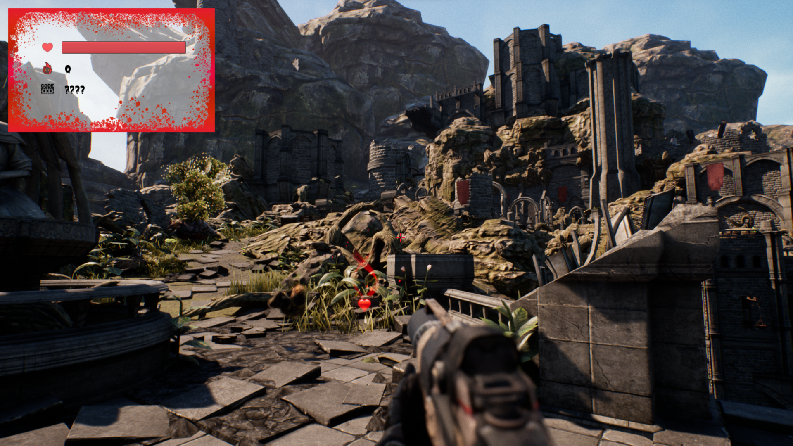
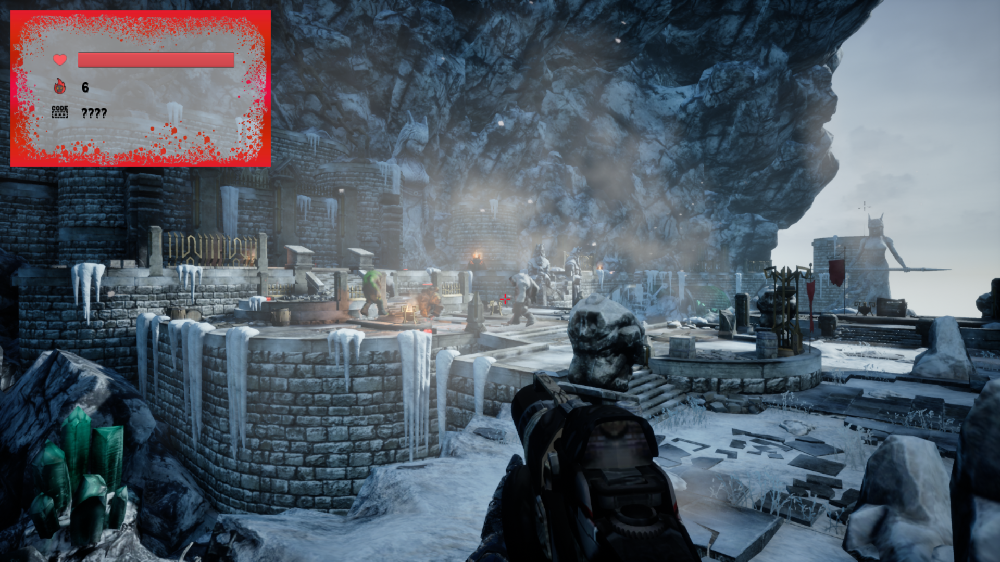

# FPS Shooter Game

This project is a first-person shooter (FPS) game developed using Unreal Engine 4.

## Features

- Player movement using the ZQSD keys
- Shooting targets with the left mouse button
- Score system to track the number of monsters killed
- Enemies that attack the player
- Power-ups to enhance player abilities

## Installation

1. Clone this repository to your local machine.
2. Make sure you have [Unreal Engine 4.27.2](https://www.unrealengine.com/) installed.
3. Open the project in Unreal Engine 4.
4. Build and run the game.

## Screenshots

